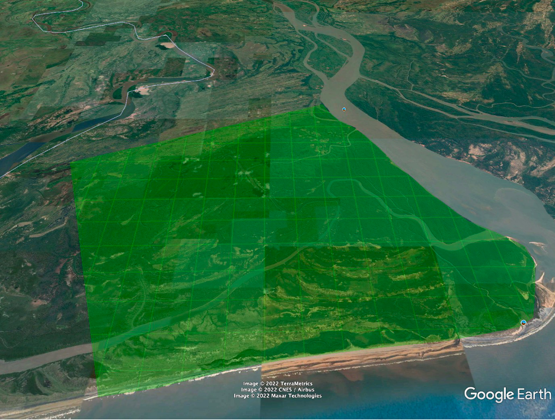
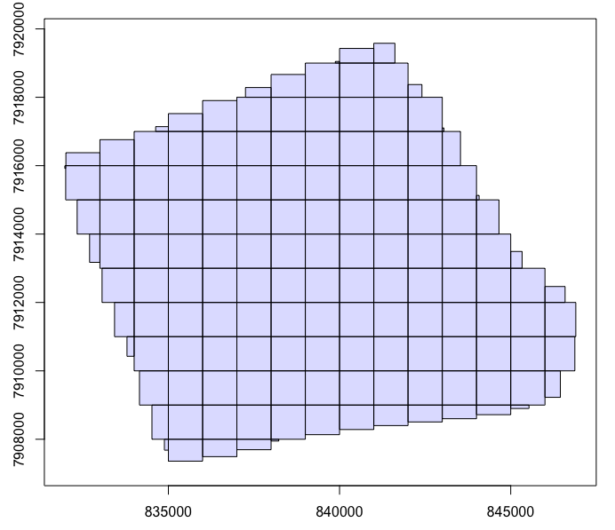
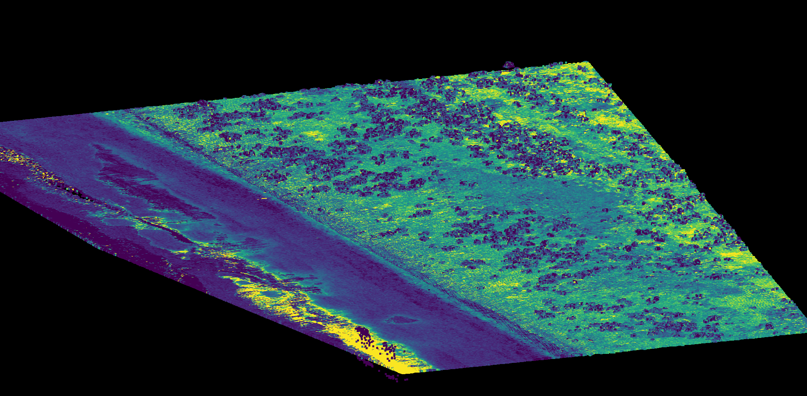
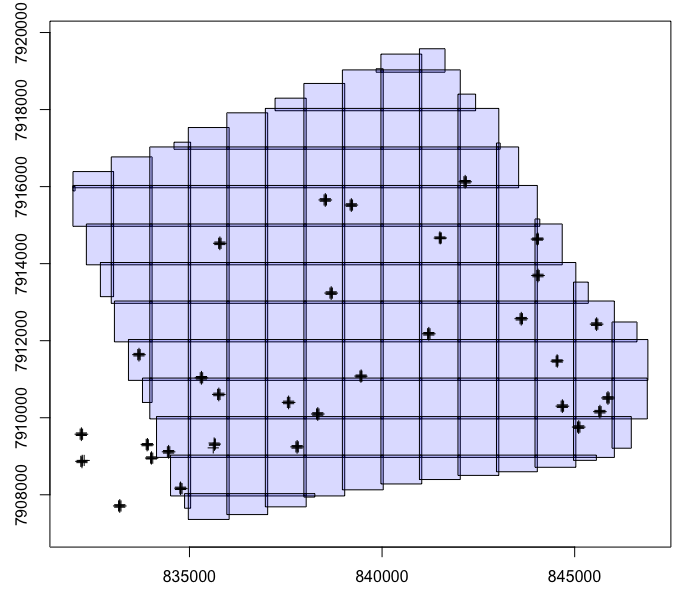
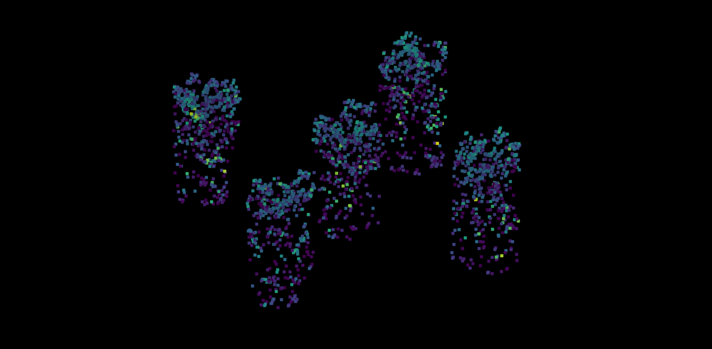
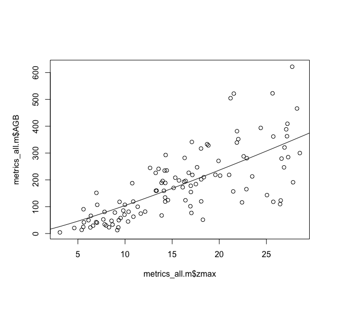

# Getting Started with LiDAR Data

## Installation of lidR

First you will need to install lidR and all dependencies. Follow the instructions on the GitHub page [here](https://github.com/r-lidar/lidR). Simply installing using the `install.packages`function. The following packages are necessary to run the code in this tutorial:
```r
library(maptools)
library(raster)
library(rgdal)
library(dplyr)
library(stringr)
library(viridis)
library(lidR)
library(rlas)
library(future)
library(parallel)
```    

## Download LiDAR data in R

Now you'll need to download the lidar data used in this tutorial. We will be using an ALS dataset collected in the Zambezi Delta over a mangrove forest. Here's a view of the area with lidar data overlayed in green:



Download the public lidar data from [here](https://daac.ornl.gov/cgi-bin/dsviewer.pl?ds_id=1521).

You will need to sign up/register for an EarthData account to get access to these lidar data. You can also download from this link [here]() (not guaranteed to be active).

Once you have downloaded the lidar data place the files in the `data/lidar` directory.

## Read and Setup the LAS catalog

Now we need to find our LAS files and access them for further processing. First, we read the file list. Then we make that list into a catalog, which essentially enables parallel processing and reduces edge effects in the resulting maps. LiDAR data is nearly always "tiled" - meaning the 3D data is split into small chunks (1 km x 1 km, for example). The catalog is made of these lidar tiles.

```{r}
#set directory for las files
las_dir<-"data/lidar"
las_files<-list.files(las_dir, pattern = ".las", full.names = TRUE)

#what is the projection?
proj.utm<-crs(readOGR(list.files(pattern="shp")))

#create a las catalog and set projection
ctg <- catalog(las_files)
crs(ctg)<-proj.utm
plot(ctg, mapview = TRUE)

```


Next we can conveniently change the naming scheme for the processed lidar files. Since we will first be normalizing the lidar point cloud by topography we use `_NORM` in our naming convention.

```{r}
#set output file format
opt_output_files(ctg) <- paste(las_dir,"/normalized/{ORIGINALFILENAME}_NORM",sep = "")
```

Now we must setup our processing to run in parallel. This will ensure we are using the CPU cores and resources that are available to us. I like to leave two cores free so the computer doesn't become super bogged down. You can adjust this with `set_lidr_threads`.

```{r}
#set up for running in parallel
cores<-detectCores()
set_lidr_threads(cores-2)
plan(multisession, workers=cores-2)
```

## Create a custom function for normalizing the LiDAR data

Finally, we will create a function to normalize the las data.

```{r}
#Create las normalizing function
myfun = function(cluster, ...)
{
  las = readLAS(cluster)
  crs(las)<-proj.utm
  if (is.empty(las)) return(NULL)
  
  #adjust "res" depending on lidar quality. 
  #Lower resolution lidar required the DEM resolution to be higher.
  DTM<-grid_terrain(las, res = 5, knnidw(rmax=100))
  
  #normalize lidar
  las_norm <- las-DTM
  return(las_norm)
}

#apply function to entire las catalog
catalog_apply(ctg, myfun)
```
A new folder names `normalized` will be created in the same folder with the las data containing the same lidar data, but now normalized to the topography.



## Clip the forest inventory plots out of the LiDAR data

Now that we have flattened our lidar data we can clip out our plot locations, allowing us to later derive point cloud statistics.

First we will read in the plot level data and make it into a spatial object. These data describe the location of data collection (plot center) and a number of useful field-measured variables. We are most interested in biomass for this tutorial, but field data may also include other ecological variables (e.g. animal observations) that may be linked to the lidar data.

```{r}
#Read plot data. This must be modified depending on input data format.
plots<-read.csv("data/field/Zambezi_2013_Subplot_Data.csv")

#Make a spatial object
plots.sp<-SpatialPointsDataFrame(coords=cbind(plots$Longitude,plots$Latitude)[!is.na(plots$Longitude),1:2],
                                 data=plots[!is.na(plots$Longitude),1:32],
                                 proj4string = crs(raster()))
```

We must reproject the plot locations into the UTM coordinate system (same as the lidar).

```{r}
#Reproject plots to lat/lon
plots.sp.t<-sp::spTransform(plots.sp, proj.utm)
```

Again, we will create a las catalog and complete the setup as in the previous section.

```{r}
#location of normalized las data
las_dir<-paste0(las_dir,"/normalized")

#create another las catalog with normalized data
ctg <- catalog(las_dir)
crs(ctg)<-proj.utm

#Do plots line up with las tiles?
plot(ctg)
plot(plots.sp.t, add=TRUE)
```
Here we can see where the plot locations are relative to the lidar data.

Finally, we will use the `clip_circle` or `clip_rectangle` function to create the plot-level lidar point clouds.

```{r}
#Output file naming scheme
opt_output_files(ctg) <- paste(las_dir,"/plots/{ID}",sep = "")

#use the correct plot clipping function depending on plot geometry. This is most often circular, but could also be a rectangle and polygon geometry.

clip_circle(ctg, plots.sp.t@coords[,1], plots.sp.t@coords[,2], radius = 7)

# clip_rectangle(ctg, plots.sp.t@coords[,1]-36, plots.sp.t@coords[,2]-36,
#                plots.sp.t@coords[,1]+36, plots.sp.t@coords[,2]+36)
```
Let's visualize how the plots align with the lidar data.



Below you can see the lidar data clipped to the plot areas. In this case we have a center plot and 4 other surrounding plots.



## Derive LiDAR Statistics from Clipped Plots

Since we now have plots clipped out of out lidar data we can compute some statistics from the cloud of points associated with each forest plot.

As before, we need to point to the clipped plot-level lidar data.

```{r}
# Get plot-level LiDAR metrics

#Set lidar plot directory
las_dir<-paste0(las_dir,"/normalized/plots")
las_files<-list.files(las_dir, pattern = "las")
```

Next we are creating an apply function and using it on the list of plot data. This function basically reads in the las data and derives a suite of useful statistical metrics from the point cloud. The `stdmetrics` computes this for us.

```{r}
#Extract lidar metrics from plot list
metrics_ls<-lapply(1:length(las_files), function(x){
  i<-x
  
  #read plot LAS file
  las<-readLAS(list.files(las_dir, pattern = "las", full.names = TRUE)[i])
  #set projection
  crs(las)<-proj.utm
  
  #get LiDAR metrics
  return(
    
    data.frame(ID = as.character(gsub(".las", "", las_files[i])), 
                              cloud_metrics(las, stdmetrics(X,Y,Z,Intensity,ReturnNumber,Classification)),
                              stringsAsFactors = FALSE)
    )
})

metrics_all<-do.call(rbind,metrics_ls)
```

Next we must connect the plot-level data to our statistical metrics. We import the plot data, select the columns we want to include in our predictive model. Here we want to model biomass so we select the biomass density column and create a dataframe linking the plot ID and AGB. Finally we save the linked data for modeling later.

```{r}
#Match plot ID names
metrics_all$Plot.Subplot<-as.character(plots.sp.t@data$Plot.Subplot)[as.numeric(metrics_all$ID)]

#merge lidar metrics to plot data
metrics_all.m<-merge(metrics_all, na.omit(data.frame(Plot=plots$Plot,
                                                     Plot.Subplot=plots$Plot.Subplot,
                                                     AGB=plots$Total.AGB,
                                             height.mean=plots$mean_height,
                                             height.max=plots$H100_field)), by="Plot.Subplot")

#what is the noData value? Exclude those plot that do not overlap with lidar data
metrics_all.m<-metrics_all.m[metrics_all.m$AGB<1000,]

dir.create("output")
write.csv(metrics_all.m, "output/metrics_all_m.csv", row.names = FALSE)
```

## Fit statistical models from LiDAR metrics

Now that we have some useful statistics derived from the lidar plot locations we can use these varibles to estimate aboveground biomass (AGB). I've included 4 different methods of using the statistics from the lidar data to model AGB. In the interest of brevity we will be focusing on example 3 (non-linear regression) since it is a simple model and provides nice stable predictions. I'm placing all methods below, but If you have questions on the other methods or wish they be expanded / explained please let me know.

The common process across all of these methods involves describing the model type and variables, checking the residual error (RMSE is used here), and visually inspecting the model against the true values. You will see this process repeated 4 times below.

```{r}
#read in plot data and metrics
metrics_all.m<-read.csv("output/metrics_all_m.csv")

#We have a few options for building an AGB model with lidar.
# 1) linear regression (lm)
# 2) multivariate linear regression (lm)
# 3) non-linear regression (nls)
# 4) machine learning (randomForest)


# 1) Linear Regression

#build a linear regression
lr.m<-lm(AGB~zmax, metrics_all.m)

#check RMSE?
sqrt(mean((predict(lr.m)-metrics_all.m$AGB)^2))/mean(metrics_all.m$AGB)
sqrt(mean((predict(lr.m)-metrics_all.m$AGB)^2))

#how does the model fit?
plot(predict(lr.m), metrics_all.m$AGB)
abline(0,1)

# 2) Multivariate Linear Regression - what variables are important?

library(leaps)
AGBreg<-regsubsets(AGB~., nbest=3, nvmax=5, data=metrics_all.m[,-c(1,2,8,59,61:62)], really.big = T)
summary(AGBreg)
plot(AGBreg)

#build a multi-linear regression
mlr.m<-lm(AGB~zmax+zsd+zq40, metrics_all.m)

#check RMSE?
sqrt(mean((predict(mlr.m)-metrics_all.m$AGB)^2))/mean(metrics_all.m$AGB)
sqrt(mean((predict(mlr.m)-metrics_all.m$AGB)^2))

#how does the model fit?
plot(predict(mlr.m), metrics_all.m$AGB)
abline(0,1)


# 3) non-linear regression (nls)

#does a height metric look non-linear?
plot(metrics_all.m$zmax, metrics_all.m$AGB)

#fit a non-linear model
nls.m<-nls(AGB~a*zmax^b, start=list(a=0.1,b=1),metrics_all.m)

#look at the model
lines(0:30,predict(nls.m, newdata=data.frame(zmax=0:30)))

#check error
sqrt(mean((predict(nls.m)-metrics_all.m$AGB)^2))/mean(metrics_all.m$AGB)
sqrt(mean((predict(nls.m)-metrics_all.m$AGB)^2))

library(randomForest)

#we can also use random forest - not always ideal
rf.m<-randomForest(AGB~., do.trace=TRUE,data=metrics_all.m[,-c(1,7, 59:60)],
                   ntree=1000)
plot(rf.m)
names(importance(rf.m)[rev(order(importance(rf.m))),])[1:10]
randomForest::varImpPlot(rf.m)

rf.m<-randomForest(AGB~zq90+zmax+zq55, do.trace=TRUE,data=metrics_all.m)

library(caret)
sqrt(mean((predict(rf.m)-metrics_all.m$AGB)^2))/mean(metrics_all.m$AGB)
sqrt(mean((predict(rf.m)-metrics_all.m$AGB)^2))

plot(predict(rf.m), metrics_all.m$AGB)
abline(0,1)
```


## Map Biomass using LiDAR data

THE MOMENT WE'VE ALL BEEN WAITING FOR.....MAPPING BIOMASS!!!!


Now since we've done it a few times, we can quickly point to the normalized LiDAR data and setup the LiDAR catalog:

```{r} 
library(errors)

las_dir<-"data/lidar/CMS_LiDAR_Point_Cloud_Zambezi_1521/data"
las_dir<-paste0(las_dir,"/normalized")
las_files<-list.files(las_dir, pattern = ".las", full.names = TRUE)

proj.utm<-crs(readOGR(list.files("data/lidar/",pattern="shp", full.names = TRUE)))

ctg <- catalog(las_files)
crs(ctg)<-proj.utm
opt_chunk_buffer(ctg) <- 10
plot(ctg, mapview = TRUE)
plot(plots.sp.t, add=TRUE)

opt_output_files(ctg) <- paste(las_dir,"/AGB_SubPlot_nls_model/{ORIGINALFILENAME}_AGB",sep = "")

library(parallel)
library(future)

cores<-detectCores()
set_lidr_threads(cores-2)
plan(multisession, workers=cores-2)
```

The below script is a little involved, but I will try to explain the major processing steps.

First, we read in the normalized las data. Next we calculate the same statistics calculated on the individual plots, but instead across the entire study area at the SAME resolution as the plot size (7 m resolution). Next, we use the errors package along with the model parameters to get an estimate of the uncertainty for each 7 m pixel (derived purely from the model parameters and not accounting for measurement uncertainty). Finally we predict biomass using the derived statistical metrics and our AGB model. 

We apply this function to the catalog and it will produce a number of tif files with our biomass estimates.

```{r}
myfun = function(cluster, ...)
{
  las = readLAS(cluster)
  crs(las)<-proj.utm
  if (is.empty(las)) return(NULL)
  
  las.metrics<-grid_metrics(las, res = 7, .stdmetrics_z)
  las.metrics<-dropLayer(las.metrics, 6)
  

  require(errors)
  
  y1 <- set_errors(coef(nls.m)[1], sqrt(vcov(nls.m)[1, 1]))
  y2 <- set_errors(coef(nls.m)[2], sqrt(vcov(nls.m)[2, 2]))
  
  covar(y1, y2) <- vcov(nls.m)[1, 2]
  
  AGB<-setMinMax(predict(las.metrics, nls.m))

  r.e<-getValues(las.metrics[['zmax']])
  
  pred<-(y1*r.e^y2)
  
  AGB.errors<-AGB
  values(AGB.errors)<-errors(pred)
  values(AGB)<-as.numeric(pred)
  
  plot(stack(AGB,AGB.errors))
  
  return(stack(AGB,AGB.errors))
  
}

catalog_apply(ctg, myfun)
```


